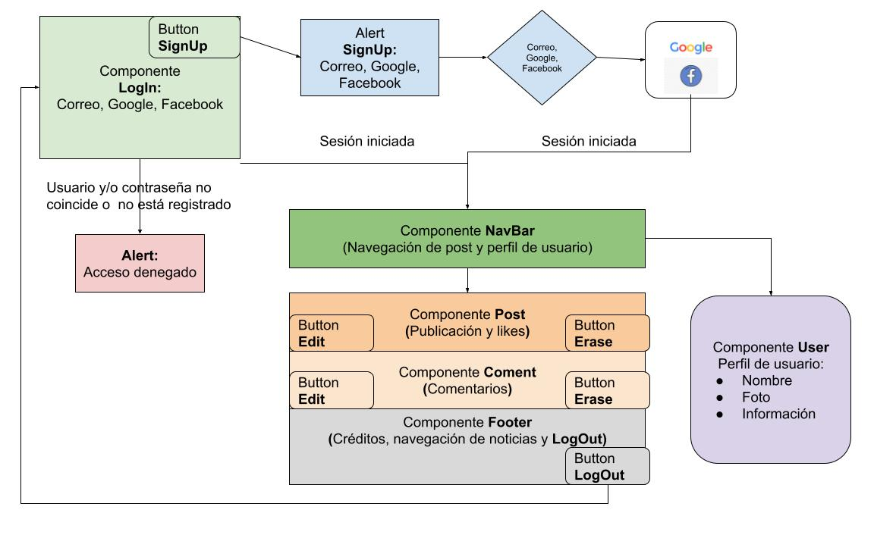
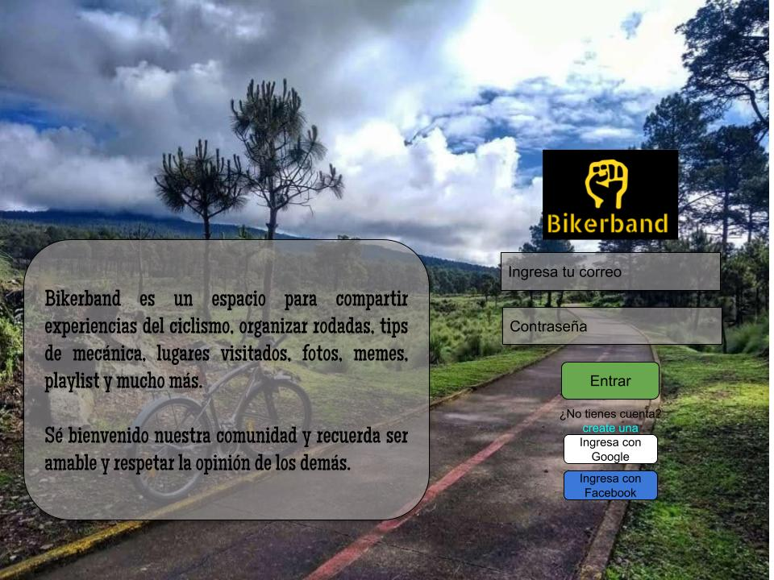

# Social Network Practice: Bikerband

Hoy día las redes sociales han marcado un hito en materia de difusión masiva, gracias a su alcance, su interactividad, almacenamiento de archivos, la libertad de expresión, los servicios que se ofrecen, así como la inmediatez relativa de sus posibilidades en responder a la atención de necesidades emergentes de la sociedad actual, desde casi cualquier lugar con cualquier persona que tenga un dispositivo tecnológico de comunicación y una conexión a internet.

El objetivo común de las redes sociales se cumple al permitir participar y comunicarnos mediante el uso de múltiples herramientas tecnológicas disponibles, con grupos específicos de interés, así como la participación al crear, editar, comentar, e incluso borrar contenido que se comparte con la sociedad de los medios. A su vez, gracias a las redes sociales la sociedad de información y conocimiento se enriquece y nos nutre de sus saberes.

Índice:

1. Descripción
2. Definición de usuarios
3. Criterios de aceptación
4. Requerimientos técnicos
5. Diagrama de Flujo
6. Maquetado
7. Aprendizajes desarrollados

---

## 1. Descripción

El objetivo general de este proyecto es crear una herramienta tecnológica de difusión masiva que promueva el deporte enfocado en el ciclismo mediante una red social. A fin de brindar las bases de interacción en la web para compartir información sobre eventos ciclistas tal como la organización de rodadas locales, competencias profesionales y rodadas con causa, así como sugerencias sobre salud y bienestar, consejos sobre mecánica básica, lugares visitados con la bicicleta, compartir fotos, videos, memes, enlaces de otras redes y brindar la oportunidad de comentar una opinión al respecto. Aunado a ello, se desarrollan atajos que permitan editar o borrar sus propias publicaciones.

Para el logro de este proyecto se construye un Single Page Application (SPA) como Red Social (CRUD) llamada "Bikerband"con capacidad para recibir cualquier número de usuarios y siendo escalable. Se utiliza ReactJS, servicios de autentificación de Firebase y Firestore DB.

---

## 2. Definición de usuarios

Los usuarios son mayores de 15 años, sin distinción de género, que gusten de hacer ciclismo (en cualquiera de sus disciplinas), ya sea profesional o recreativo.

La interfaz debe permitir a los visitantes:

- Acceso:

  - Correo electrónico
  - Número de teléfono
  - Autentificación de Google o Facebook

- Ver el Feed de noticias de la Red Social

  - Se muestra el título, fecha de publicación, Contenido (img y texto), para cada publicación.
  - Mostrar la lista de todos los usuarios registrados con foto de perfil y nombre

- Publicar

  - Permitir que el usuario:
    - Publique contenido de texto y contenido img, sólo si ha ingresado con su usuario
    - Elimine su propia publicación si lo desea
    - Edita su propia publicación si lo desea
    - Sólo el mismo usuario como autor puede editar o eliminar sus propias publicaciones.

---

## 3. Criterios de aceptación

- Interfaz receptiva para tabletas y computadoras de escritorio
- Sólo ECS6
- Sólo lógica de componente
- Cobertura de al menos el 50% de las pruebas unitarias

---

## 4. Diagrama de Flujo

---

## 5. Maquetado

---

## 6. Aprendizajes desarrollados

- npm
- JSON
- ASYNC AWAIT
- Base de datos (DB) Firestore
- Mi primer CRUD en Firebase con React JS
- Mi primer proyecto de estructuración de datos (Data Structuring)
- Import and export components
- GitHub Branch Modeling> Development > Release
